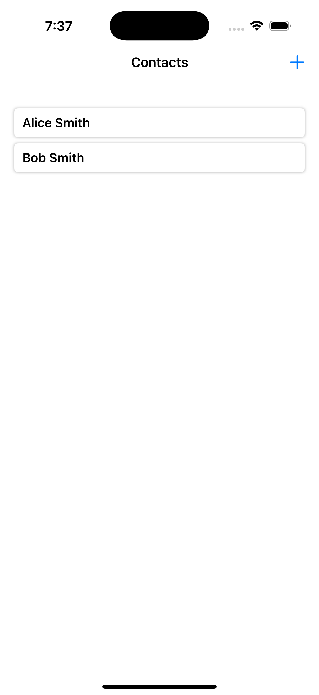
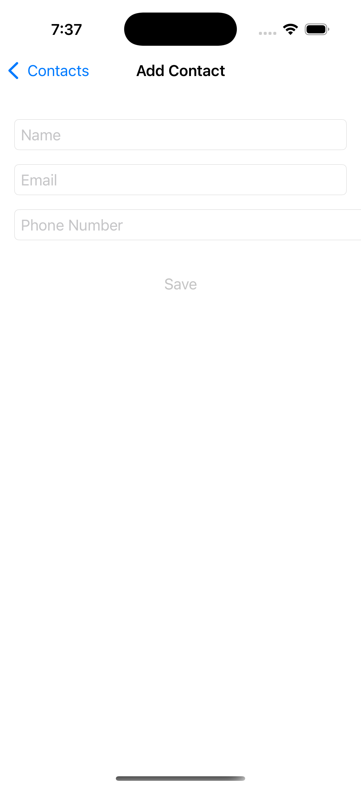
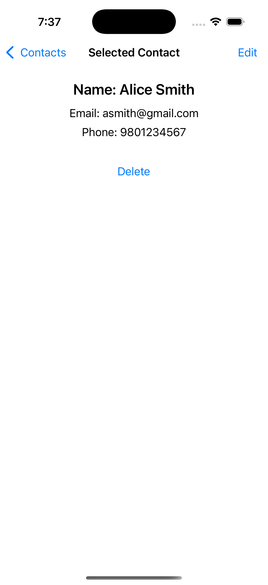
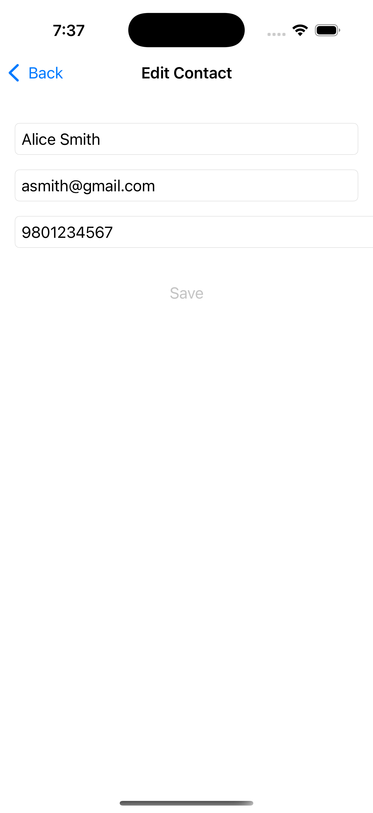
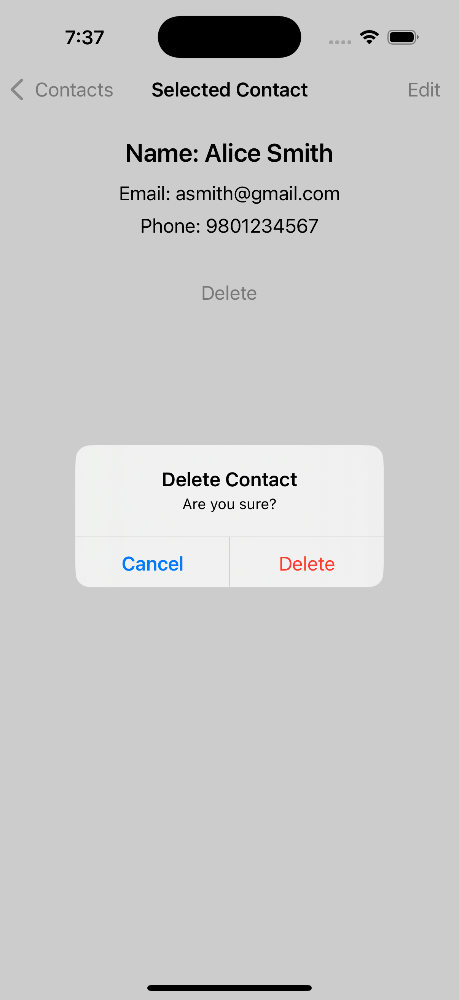

# iOS Contacts App (RESTful API)

An iOS contacts manager app built with UIKit that consumes a RESTful backend to list, create, update, and delete contacts. The project focuses on clean mobile UI, networking with Alamofire, and a simple MVC-style architecture with reusable views.

---

## ✨ Features

- **Contact List**
  - Displays all contacts pulled from the backend API
  - Supports refresh and dynamic updates

- **Add Contact**
  - Form with validation for name, phone, email, and notes
  - Sends POST request to backend API to create new record

- **View & Edit Contact**
  - Detailed screen for each contact
  - Allows editing and saving changes to backend (PUT request)

- **Delete Contact**
  - Swipe-to-delete or delete button
  - Sends DELETE request to backend API

- **RESTful API Integration**
  - GET /contacts  
  - POST /contacts  
  - PUT /contacts/{id}  
  - DELETE /contacts/{id}  

- **Multi-screen UIKit Navigation**
  - UINavigationController-based flow
  - TableView for lists
  - Clean screen-by-screen architecture

---

## 📱 Screens

```

<p float="left">
  
  
</p>
<p float="left">
  
  
  
</p>

```

---

## 🏗 Architecture

```

iOS_Contacts_App/
├── AppDelegate.swift
├── SceneDelegate.swift
├── APIConfigs.swift
├── Models/
│   └── Contact.swift
├── MainScreen/
│   ├── MainViewController.swift
│   └── MainTableViewCell.swift
├── Add Contact Screen/
│   └── AddContactViewController.swift
├── Details Screen/
│   ├── DetailsViewController.swift
│   └── EditContactView.swift (if applicable)
├── NotificationNames.swift
├── Assets.xcassets
└── Info.plist

```

---

## 🧩 Data Flow

1. **Main Screen**
   - Fetches contact list from backend (GET)
   - Displays using UITableView

2. **Add Contact Screen**
   - User enters contact info → POST to server
   - Notifies main screen using NotificationCenter

3. **Details Screen**
   - Shows selected contact
   - Supports editing → PUT request
   - Supports deleting → DELETE request

4. **Notifications**
   - `Notification.Name.contactUpdated`
   - `Notification.Name.contactAdded`
   - Allows lightweight screen-to-screen communication

---

## 🔌 API Configuration

All endpoints and headers are centralized in:

```

APIConfigs.swift

```

- Base URL  
- Endpoints  
- URLRequest creation  
- JSON encoding/decoding

---

## 🚀 Future Improvements

- Add image/avatar support for contacts  
- Improve error handling and user-facing messages  
- Add loading indicators and empty state UI  
- Migrate to async/await  
- Add search/filter on contact list  

---

## 📦 Requirements

- Xcode 15+
- iOS 15+
- Swift 5+
- Backend API running (provided by assignment)
